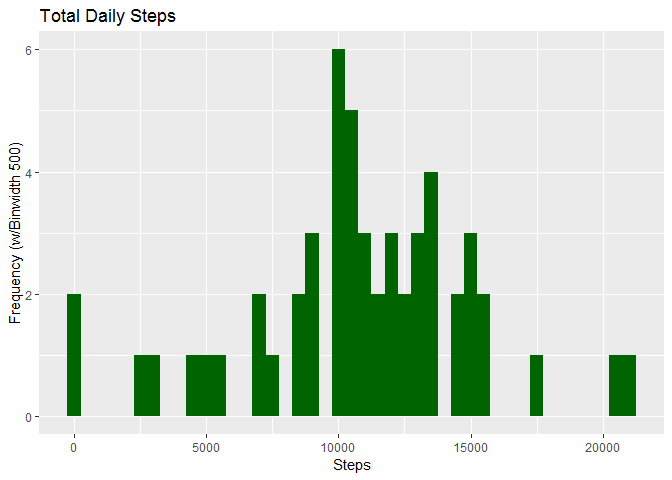
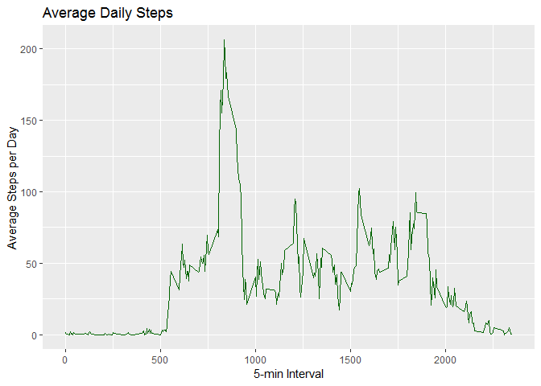
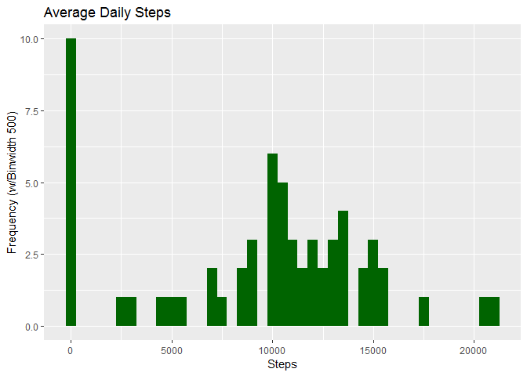
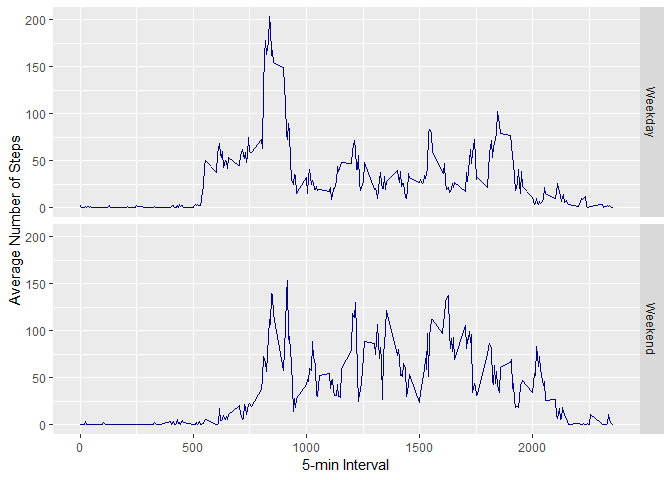

Reproducible Research - Project 1
=================================

Introduction
------------

It is now possible to collect a large amount of data about personal movement using activity monitoring devices such as a [Fitbit](), [Nike Fuelband](http://www.nike.com/us/en_us/c/nikeplus-fuelband), or [Jawbone Up](https://jawbone.com/up). These type of devices are part of the "quantified self" movement - a group of enthusiasts who take measurements about themselves regularly to improve their health, to find patterns in their behaviour, or because they are tech geeks. But these data remain under-utilized both because the raw data are hard to obtain and there is a lack of statistical methods and software for processing and interpreting the data.

-   Activity Monitoring Data Set: <https://d396qusza40orc.cloudfront.net/repdata%2Fdata%2Factivity.zip>

Preliminary steps: Loading Prerequisite Packages and Downloading the Data Set
-----------------------------------------------------------------------------

``` r
library(ggplot2)
library(data.table)

if(!file.exists('activity.csv') ){
        if (!file.exists('repdata_data_activity.zip')){
              url <- "https://d396qusza40orc.cloudfront.net/repdata%2Fdata%2Factivity.zip"
              download.file(url, destfile = paste0(getwd(), '/repdata_data_activity.zip'), method = "curl") 
        }
    unzip('repdata_data_activity.zip')
}
```

1.  Code for reading in the dataset and processing the data

``` r
DT <- data.table::fread(input = "activity.csv")
```

What is the mean total number of steps taken per day?
-----------------------------------------------------

``` r
#constructing a sub-set of DT data table with missing values (NA) present
columns <- "steps"

totalSteps <- DT[, c(lapply(.SD, sum, na.rm = FALSE)), .SDcols = columns, by = .(date)]
```

### Verifying that the Data Set which was input is correct:

``` r
head(totalSteps,10)
```

    ##           date steps
    ##  1: 2012-10-01    NA
    ##  2: 2012-10-02   126
    ##  3: 2012-10-03 11352
    ##  4: 2012-10-04 12116
    ##  5: 2012-10-05 13294
    ##  6: 2012-10-06 15420
    ##  7: 2012-10-07 11015
    ##  8: 2012-10-08    NA
    ##  9: 2012-10-09 12811
    ## 10: 2012-10-10  9900

2.  Histogram of the total number of steps taken each day

``` r
hist_plot <- ggplot(totalSteps, aes(steps)) +
        geom_histogram(fill = "darkgreen", binwidth = 500) +
                labs(title = "Total Daily Steps", x = "Steps", y = "Frequency (w/Binwidth 500)") 

plot(hist_plot)
```

    ## Warning: Removed 8 rows containing non-finite values (stat_bin).



3.  Reporting Mean and Median number of steps taken each day:

``` r
totalSteps[, .(`Mean # of Steps` = mean(steps, na.rm = TRUE), `Median # of Steps` = median(steps, na.rm = TRUE))]
```

    ##    Mean # of Steps Median # of Steps
    ## 1:        10766.19             10765

What is the average daily activity pattern?
-------------------------------------------

1.  Make a time series plot (i.e. type="l") of the 5-minute interval (x-axis) and the average number of steps taken, averaged across all days (y-axis)

\*\* Time series plot of the average number of steps taken:

``` r
interval <- DT[, c(lapply(.SD, mean, na.rm = TRUE)), .SDcols = columns, by = list(interval)]

head(interval,10)
```

    ##     interval     steps
    ##  1:        0 1.7169811
    ##  2:        5 0.3396226
    ##  3:       10 0.1320755
    ##  4:       15 0.1509434
    ##  5:       20 0.0754717
    ##  6:       25 2.0943396
    ##  7:       30 0.5283019
    ##  8:       35 0.8679245
    ##  9:       40 0.0000000
    ## 10:       45 1.4716981

``` r
ggplot(interval, aes(x = interval , y = steps)) + geom_line(color="darkgreen", size=0.5) + labs(title = "Average Daily Steps", x = "5-min Interval", y = "Average Steps per Day")
```



2.  Which 5-minute interval, on average across all the days in the dataset, contains the maximum number of steps?

``` r
interval[steps == max(steps), list(`Maximum Intreval` = interval)]
```

    ##    Maximum Intreval
    ## 1:              835

Imputing missing (NA) values
----------------------------

1.  Calculate and report the total number of missing values in the dataset (i.e. the total number of rows with NAs)

``` r
message("Total number of missing values (NAs) in the orig. Data Set: ", nrow(DT[is.na(steps),]))
```

    ## Total number of missing values (NAs) in the orig. Data Set: 2304

2.  Devise a strategy for filling in all of the missing values in the dataset. For example, you could use the mean/median for that day, or the mean for that 5-minute interval, etc.

``` r
# Imputing the missing values (NA) in Data Set (DT) with Median values 
DT[is.na(steps), "steps"] <- DT[, c(lapply(.SD, median, na.rm = TRUE)), .SDcols = columns]

# verifying Data Set (DT) after imputing missing values
head(DT, 10)
```

    ##     steps       date interval
    ##  1:     0 2012-10-01        0
    ##  2:     0 2012-10-01        5
    ##  3:     0 2012-10-01       10
    ##  4:     0 2012-10-01       15
    ##  5:     0 2012-10-01       20
    ##  6:     0 2012-10-01       25
    ##  7:     0 2012-10-01       30
    ##  8:     0 2012-10-01       35
    ##  9:     0 2012-10-01       40
    ## 10:     0 2012-10-01       45

3.  Create a new dataset that is equal to the original dataset but with the missing data filled in.

``` r
# saving the newly updated DT
data.table::fwrite(x = DT, file = "clean_set.csv", quote = FALSE)
```

4. a)  Plotting a histogram for the total number of steps taken each day. What is the impact of imputing missing data on the estimates of the total daily number of steps?

``` r
totalSteps_imp <- DT[, c(lapply(.SD, sum)), .SDcols = columns, by = list(date)] 

head(totalSteps_imp,20)
```

    ##           date steps
    ##  1: 2012-10-01     0
    ##  2: 2012-10-02   126
    ##  3: 2012-10-03 11352
    ##  4: 2012-10-04 12116
    ##  5: 2012-10-05 13294
    ##  6: 2012-10-06 15420
    ##  7: 2012-10-07 11015
    ##  8: 2012-10-08     0
    ##  9: 2012-10-09 12811
    ## 10: 2012-10-10  9900
    ## 11: 2012-10-11 10304
    ## 12: 2012-10-12 17382
    ## 13: 2012-10-13 12426
    ## 14: 2012-10-14 15098
    ## 15: 2012-10-15 10139
    ## 16: 2012-10-16 15084
    ## 17: 2012-10-17 13452
    ## 18: 2012-10-18 10056
    ## 19: 2012-10-19 11829
    ## 20: 2012-10-20 10395

4. b) What is the impact of imputing missing data on the estimates of the total daily number of steps?

``` r
ggplot(totalSteps_imp, aes(x = steps)) + geom_histogram(fill = "darkgreen", binwidth = 500) + labs(title = "Average Daily Steps", x = "Steps", y = "Frequency (w/Binwidth 500)")
```



4. c) Calculate and report the mean and median total number of steps taken per day. Do these values differ from the estimates from the first part of the assignment?

-   Mean and Median \# of Steps based on the imputed Data Set:

``` r
# mean and median total number of steps taken per day
totalSteps_imp[, .(`Mean # of Steps` = mean(steps), `Median # of Steps` = median(steps))]
```

    ##    Mean # of Steps Median # of Steps
    ## 1:         9354.23             10395

### Vis-a-vis Mean and Median \# of steps WITHOUT missing values (NA) getting subsituted with Medians

``` r
totalSteps[, .(`Mean # of Steps` = mean(steps, na.rm = TRUE), `Median # of Steps` = median(steps, na.rm = TRUE))]
```

    ##    Mean # of Steps Median # of Steps
    ## 1:        10766.19             10765

Are there differences in activity patterns between weekdays and weekends?
-------------------------------------------------------------------------

1.  Create a new factor variable in the dataset with two levels - "weekday" and "weekend" indicating whether a given date is a weekday or weekend day.

``` r
# re-read DT from the imputed Data Set
DT <- read.csv('clean_set.csv')

# if 'date' is Sunday or Saturday, then it is a Weekned, else: Weekday
DT$DayType <-  ifelse(as.POSIXlt(DT$date)$wday %in% c(0,6), 'Weekend', 'Weekday')
```

2.  Make a panel plot containing a time series plot (i.e. type="l") of the 5-minute interval (x-axis) and the average number of steps taken, averaged across all weekday days or weekend days (y-axis).

``` r
# create an aggregated table: group by interval, then DayType and output a 'mean' # of steps for e/grouping
aggrDT <- aggregate(steps ~ interval + DayType, data=DT, mean)

ggplot(aggrDT, aes(interval, steps)) + 
    geom_line(color="darkblue", size=0.5) + 
    facet_grid(DayType ~ .) +
    xlab("5-min Interval") + 
    ylab("Average Number of Steps")
```


